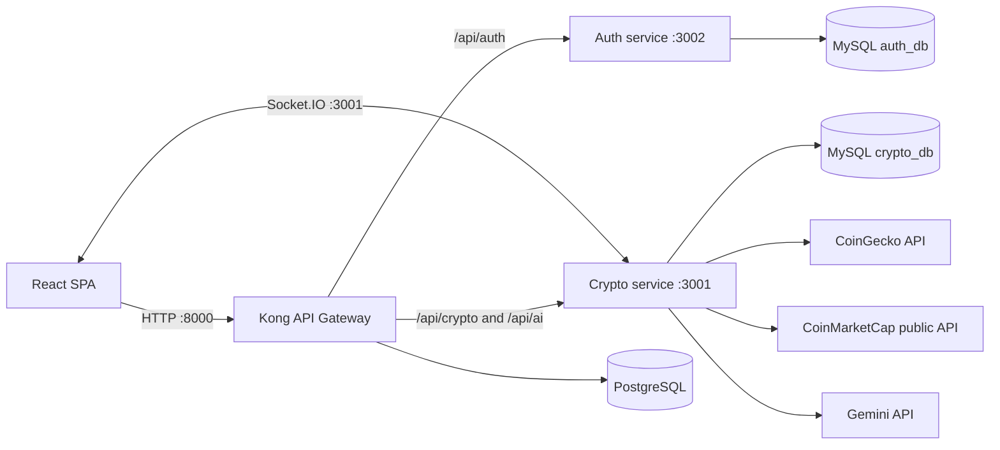

# Crypto Market Analytics Platform

A full-stack cryptocurrency market dashboard inspired by CoinMarketCap. The application combines live market data, personal watchlists, JWT authentication, WebSocket updates, and a Gemini-powered AI assistant behind a Kong API Gateway.

## Features

- Top cryptocurrency prices, market metrics, sparklines, and network filters
- Search, configurable table columns, display preferences, and responsive navigation
- Account registration and login with bcrypt password hashing and JWT access tokens
- Per-user watchlists stored in MySQL
- Socket.IO market snapshots with a configurable refresh interval
- Market overview cards with cached upstream data and stale-data fallback
- Gemini AI Copilot for cryptocurrency questions
- Separate authentication and crypto services routed through Kong

## Technology stack

| Layer | Technology |
| --- | --- |
| Frontend | React 19, TypeScript, Vite, Zustand, Ant Design, Axios, Socket.IO Client |
| Crypto API | NestJS, TypeORM, MySQL, Socket.IO, Google Gen AI SDK |
| Authentication API | NestJS, TypeORM, MySQL, JWT, bcrypt |
| Infrastructure | Docker Compose, Kong Gateway, PostgreSQL for Kong |
| External data | CoinGecko API, CoinMarketCap public endpoints, Gemini API |

## Architecture



See [Architecture](docs/architecture.md) for component responsibilities and data flows.

## Prerequisites

- Node.js 20 or newer
- npm
- Docker Desktop with Docker Compose
- PowerShell 7 or Windows PowerShell for the Kong setup script
- A Gemini API key to use the AI Copilot

## Quick start

### 1. Configure environment files

```powershell
Copy-Item frontend/.env.example frontend/.env
Copy-Item backend/.env.example backend/.env
```

Set `GEMINI_API_KEY` in `backend/.env`. The remaining example values work with the local ports documented below.

### 2. Start databases and Kong

```powershell
docker compose up -d
```

Wait until the containers are healthy, then register the API services and routes:

```powershell
powershell -ExecutionPolicy Bypass -File .\scripts\setup-kong.ps1
```

### 3. Install dependencies

```powershell
npm --prefix auth-ms install
npm --prefix backend install
npm --prefix frontend install
```

### 4. Start the applications

Open three terminals from the repository root:

```powershell
npm --prefix auth-ms run start:dev
```

```powershell
npm --prefix backend run start:dev
```

```powershell
npm --prefix frontend run dev
```

Open <http://localhost:5173>. HTTP requests use Kong at <http://localhost:8000>; Socket.IO connects directly to the crypto service at <http://localhost:3001> by default.

## Local ports

| Port | Service |
| --- | --- |
| `5173` | Vite frontend |
| `3001` | Crypto API and Socket.IO |
| `3002` | Authentication API |
| `8000` | Kong proxy |
| `8001` | Kong Admin API; local development only |
| `3306` | Authentication MySQL |
| `3307` | Crypto MySQL |
| `5432` | Kong PostgreSQL |

## Quality checks

```powershell
npm --prefix frontend run lint
npm --prefix frontend run build
npm --prefix backend run test
npm --prefix backend run test:e2e
npm --prefix auth-ms run test
npm --prefix auth-ms run test:e2e
```

Some generated NestJS starter tests may not yet represent the current application behavior. See [Testing Strategy](docs/testing-strategy.md) for the current baseline and proposed coverage.

## Documentation

- [Environment variables](docs/environment-variables.md)
- [Architecture](docs/architecture.md)
- [API reference](docs/api.md)
- [Testing strategy](docs/testing-strategy.md)
- [Threat model](docs/threat-model.md)
- [Architecture decisions](docs/adr/README.md)
- [Roadmap](docs/roadmap.md)
- [Weekly development notes](docs/week-1.md)

## Current limitations

- Database connection settings and the JWT secret are currently hard-coded for local development.
- TypeORM `synchronize` is enabled; migrations are not yet configured.
- Kong Admin API and database ports are exposed locally without production hardening.
- Socket.IO connects directly to port `3001` instead of being routed through Kong.
- The repository does not yet include automated CI or complete feature-level test coverage.

Do not deploy the current local configuration to a public environment without completing the security items in the [roadmap](docs/roadmap.md).
