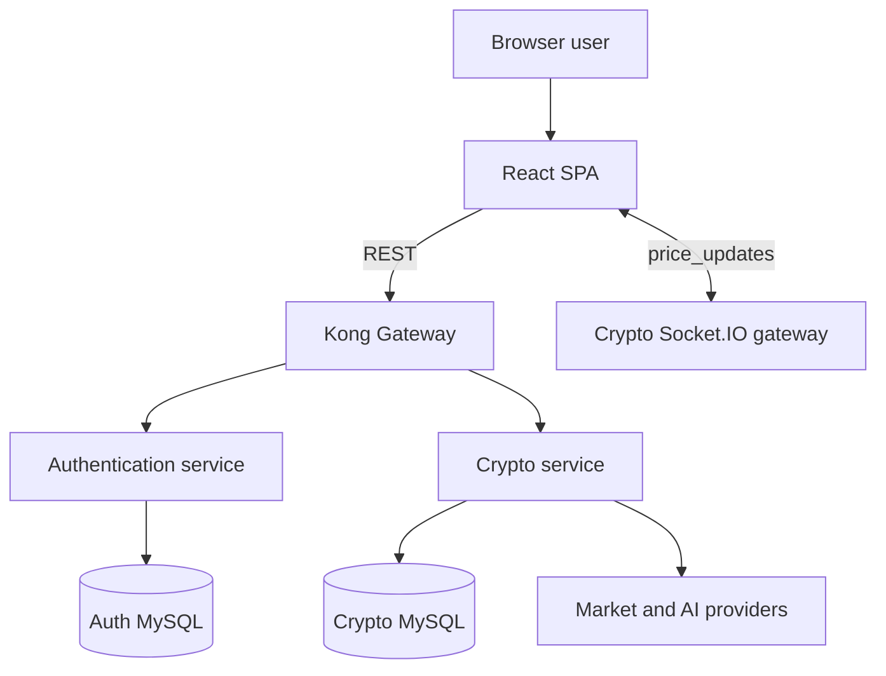

# Architecture

## System context

The project is a local-development microservice-style application. A React single-page application uses Kong for HTTP routing and connects directly to the crypto service for Socket.IO updates.

## Components

### Frontend

- Renders the market dashboard, authentication flows, watchlist, filters, and AI Copilot.
- Stores client UI state with Zustand and persisted browser storage where applicable.
- Adds the JWT access token to API calls through a shared Axios interceptor.
- Removes local authentication data after an HTTP `401` response.

### Kong API Gateway

Kong exposes a single HTTP entry point on port `8000`:

| Route prefix | Upstream |
| --- | --- |
| `/api/auth` | Authentication service on `3002` |
| `/api/crypto` | Crypto service on `3001` |
| `/api/ai` | Crypto service on `3001` |

The idempotent local setup script is `scripts/setup-kong.ps1`.

### Authentication service

- Registers users and stores bcrypt password hashes in `auth_db`.
- Authenticates credentials and issues one-day JWT access tokens.
- Provides a token verification endpoint.

### Crypto service

- Normalizes top-coin data from CoinGecko.
- Retrieves market overview data from CoinMarketCap public endpoints.
- Stores each authenticated user's watchlist in `crypto_db`.
- Refreshes market data periodically and emits `price_updates` over Socket.IO.
- Proxies AI prompts to Gemini through the AI service.

## Main data flows

### Login

1. The frontend posts credentials to Kong at `/api/auth/login`.
2. Kong forwards the request to the authentication service.
3. The service compares the supplied password with the stored bcrypt hash.
4. The frontend stores the returned access token and sends it as `Authorization: Bearer <token>` on later requests.

### Watchlist

1. The frontend sends an authenticated request through Kong.
2. The crypto service validates the JWT locally with `JwtAuthGuard`.
3. The service reads or changes watchlist rows scoped by the JWT subject.

### Market updates

1. The crypto service fetches and normalizes CoinGecko market data.
2. It keeps the latest successful snapshot in memory.
3. Socket.IO emits `price_updates` to connected browsers after each successful refresh.
4. If an upstream refresh fails, the previous snapshot remains available.

## Data ownership

| Data | Owner | Storage |
| --- | --- | --- |
| User credentials | Authentication service | `auth_db` MySQL database |
| User watchlists | Crypto service | `crypto_db` MySQL database |
| Latest WebSocket market snapshot | Crypto service | Process memory |
| Market overview cache | Crypto service | Process memory |
| UI preferences and access token | Frontend | Browser local storage |

There are no cross-database foreign keys. The watchlist service trusts the JWT `sub` claim as the user identifier.
